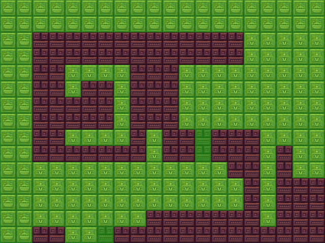

# TMX-Parser-Java
TMX Parser Made In JAVA

```java
void render(Graphics2D g){
  for (int j = 0; j < tmx.map_rows; j++) {
    for (int i = 0; i < tmx.map_cols; i++) {
      g.drawImage(tmx.tiles[j][i], null, i * tmx.size, j * tmx.size);
    }
  }
}


```

**"tmx.tiles[j][i]" returns buffered image of J'th and I'th Column.**
Above code shows full map given by tiled.

```java
void render(Graphics2D g){
  for(Rect rect:tmx.obj){
    g.setColor(new Color(0,255,0,100));
    g.fillRect(rect.x, rect.y, rect.w, rect.h);
    //x,y coordinate of object and it's width and height
  }
}
```
**tmx.obj is array list which gives objects given by Tiled**

Some images:



Green things are are the collidable objects or Touchable objects
others are just normal tiles.
